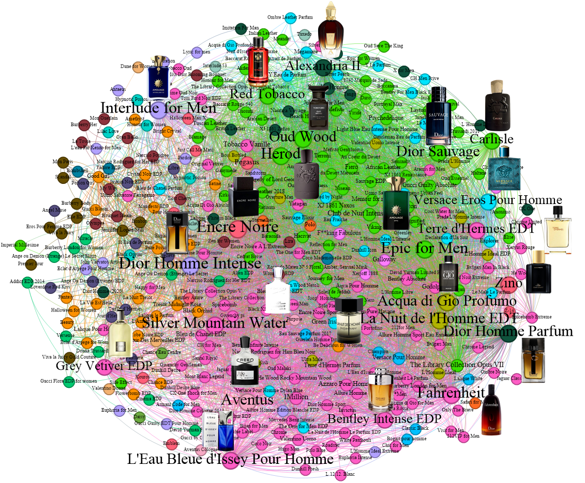

<!-- Typing Intro -->

  

##

<!-- Social Links -->

    
  
  
    

---

## About Me

- I'm a recent M.Sc. graduate in Information Technology Engineering.  
- I’m looking forward to working on new, exciting projects!  

---

## 🛠️ Libraries

  
  
  
  
  
  
  

---

## 📂 Featured Repository: [Sentiment-Driven Community Detection in a Network of Perfume Preferences](https://github.com/Kalashi-Saed-Collaborations/SentimentDrivenCommunityDetection)

  

In addition to my personal projects, I collaborate with fellow researchers on a dedicated GitHub account. This repository is part of our collaborative efforts, presenting datasets and methodologies used in our paper *"Sentiment-Driven Community Detection in a Network of Perfume Preferences."*  

We apply sentiment analysis and community detection techniques to analyze perfume preferences based on positive user reviews, uncovering shared consumer preferences in the fragrance industry.  

🔗 Check out the [repository](https://github.com/Kalashi-Saed-Collaborations/SentimentDrivenCommunityDetection) for more details.

---

## 📂 Featured Repository: [MCNN-14: Fashion Image Classification](https://github.com/Kalashi-Saed-Collaborations/MCNN-14-Fashion-Image-Classification)

  

This repository contains the implementation of **MCNN-14**, a Multiple Convolutional Neural Network model proposed in our paper:  
> Saed et al. [*“An Efficient Multiple Convolutional Neural Network Model (MCNN-14) for Fashion Image Classification.”*](https://ieeexplore.ieee.org/abstract/document/10533341). ICWR2024

We propose a novel MCNN architecture that balances **high classification accuracy** with **computational efficiency** for fashion image classification.  

> **✨ Key Contribution:** Achieved **93.08% accuracy** on the Fashion-MNIST dataset, surpassing previous benchmarks.

🔗 Check out the [repository](https://github.com/Kalashi-Saed-Collaborations/MCNN-14-Fashion-Image-Classification) for more details.
